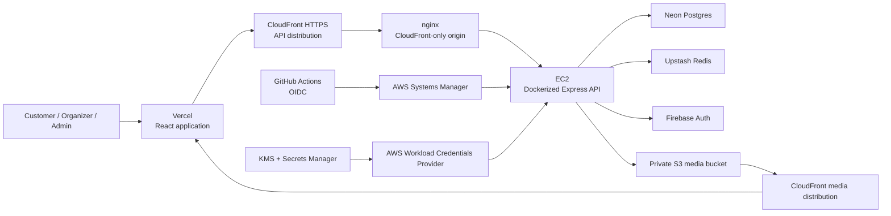

# Flash Ticketing — Full-Stack Movie Ticketing Platform

A production-deployed movie discovery, theater management, seat reservation, and ticketing
platform. The application supports customer, organizer, and administrator workflows in a single
TypeScript monorepo.

## Live application

| Service         | Live link                                                                                             | Status                             |
| --------------- | ----------------------------------------------------------------------------------------------------- | ---------------------------------- |
| Web application | **[Open Flash Ticketing](https://flash-ticketing-neon.vercel.app)**                                   | Public                             |
| Backend API     | [API health check](https://dro7vidljm1jc.cloudfront.net/health)                                       | Public HTTPS                       |
| Movie media     | [View an S3-backed showcase poster](https://d1f9tbdxdqavp.cloudfront.net/movies/showcase/kuberaa.png) | Public delivery, private S3 origin |
| Source code     | [Ashish5689/flash-ticketing](https://github.com/Ashish5689/flash-ticketing)                           | `main`                             |

The live showcase contains 11 published listings—eight movies and three live events—plus original
S3-hosted posters/banners, a Mumbai venue, multiple tiered screens, and 80 scheduled shows across
five days.

> Stripe Checkout is implemented in test mode but requires a valid `sk_test_...` key. When it is
> not configured, the application safely disables payment creation instead of exposing a broken
> checkout flow.

## What the platform supports

### Customers

- Register or sign in with Firebase email/password or Google identity.
- Browse a cinematic, poster-led catalog with a persistent city preference.
- Filter shareable catalog URLs by type, title, genre, language, city, and an inclusive show-date range.
- View seven days of availability, automatically land on the first bookable date, and compare theaters, showtimes, and tier prices.
- Select accessible 40px seats with distinct available, selected, held, and sold states.
- Atomically hold multiple seats with a five-minute countdown.
- Continue through Stripe-hosted test checkout when payment configuration is enabled.
- Confirm an order idempotently and receive a QR e-ticket.
- Review Upcoming and Past bookings, open QR tickets, and print individual ticket details.

The viewer UI is branded **Flash Ticketing** throughout and follows a cinematic editorial system:
midnight navigation, coral actions, banner-led discovery, poster-first rails, event-specific landscape
cards, responsive filter drawers, layout skeletons, and a guided Seats → Payment → Ticket journey.

### Public discovery APIs

- `GET /movies` accepts optional `dateFrom` and `dateTo` (`YYYY-MM-DD`) as an inclusive range of up to 31 days.
- `GET /movies/:id/show-dates?city=Mumbai&from=YYYY-MM-DD&days=7` returns daily show counts for 1–14 days.
- Date boundaries are evaluated in `Asia/Kolkata`; catalog results remain duplicate-free when a title has multiple matching shows.

### Organizers

- Apply for organizer access and track the approval status.
- Create and manage owned theaters and screens.
- Build reusable seat layouts with rows, aisles, and pricing tiers.
- Schedule shows and publish the complete show-seat inventory transactionally.
- Track sold, held, and available seats plus revenue per show.

### Administrators

- Review organizer applications and approve or reject them.
- Create, edit, publish, and remove catalog movies.
- Upload/crop local poster and banner images or securely import remote raster images.
- View platform analytics and suspend or restore users.
- Manage media backed by a private encrypted S3 bucket and CloudFront.

## Booking correctness

The booking path is designed around the invariant that a seat cannot be sold twice:

1. Redis uses atomic Lua operations and expiring keys to acquire all requested seats or none.
2. A failed multi-seat hold rolls back every seat acquired during that attempt.
3. PostgreSQL unique constraints protect the permanent seat/order ledger.
4. Booking confirmation executes in a database transaction and uses an idempotency key.
5. Repeated confirmations return the original order rather than creating duplicate sales.

The automated live verifier races 12 clients for the same seat and expects exactly one winner and
zero oversells.

## Production architecture



- The frontend is a static Vite build deployed on Vercel with React Router SPA rewrites.
- The API runs in Docker on Amazon Linux EC2, bound to loopback behind nginx.
- CloudFront provides API TLS; the EC2 security group accepts origin traffic only from AWS's
  CloudFront origin-facing managed prefix list.
- There is no SSH ingress or EC2 key pair. Administration and deployments use Systems Manager.
- Runtime configuration is encrypted with a customer-managed KMS key in Secrets Manager and
  resolved locally through AWS Workload Credentials Provider and `asm-exec`.
- GitHub Actions assumes a repository-scoped AWS role through OIDC, then deploys through SSM. CI
  does not store long-lived AWS access keys.
- Movie images remain private in S3 and are delivered through a separate CloudFront distribution
  using Origin Access Control.

## Technology stack

| Area           | Technology                                                                                |
| -------------- | ----------------------------------------------------------------------------------------- |
| Frontend       | React 19, TypeScript, Vite, Tailwind CSS, React Router, TanStack Query, Zustand           |
| Backend        | Node.js, Express 5, TypeScript, Zod, Pino                                                 |
| Data           | PostgreSQL on Neon, Drizzle ORM, Redis on Upstash                                         |
| Identity       | Firebase Authentication and Firebase Admin SDK                                            |
| Payments       | Stripe Checkout Sessions in test mode                                                     |
| Media          | Sharp, private Amazon S3, CloudFront OAC                                                  |
| Infrastructure | AWS CloudFormation, EC2, nginx, Docker, KMS, Secrets Manager, SSM, CloudTrail, CloudWatch |
| Delivery       | Vercel, GitHub Actions, GitHub OIDC                                                       |
| Testing        | Vitest, Supertest, live phase verifiers                                                   |

## Repository structure

```text
movie-ticketing-platform/
├── frontend/                 React/Vite application and Vercel SPA configuration
├── backend/                  Express API, Drizzle schema/migrations, seeds, and verifiers
├── infra/                    CloudFormation stacks and EC2 bootstrap/deployment scripts
├── docs/                     UI concepts and supporting project assets
├── .github/workflows/        CI and OIDC/SSM backend deployment
├── docker-compose.yml        Optional local PostgreSQL and Redis fallbacks
├── DESIGN.md                 Architecture, product decisions, and delivery phases
├── MEMORY.md                 Project progress and session history
└── package.json              npm workspace commands
```

## Local development

### Prerequisites

- Node.js 20 or newer
- npm
- A Firebase project for authentication
- PostgreSQL and Redis, either managed or through the included Docker Compose profiles
- Docker Desktop only if using the local database/Redis fallbacks
- Optional: AWS media resources and a Stripe test key

### 1. Install dependencies

```bash
git clone https://github.com/Ashish5689/flash-ticketing.git
cd flash-ticketing
npm install
```

### 2. Create local environment files

```bash
cp backend/.env.example backend/.env
cp frontend/.env.example frontend/.env
```

Backend configuration is validated at startup. The main variables are:

| Variable                         | Purpose                                                     |
| -------------------------------- | ----------------------------------------------------------- |
| `DATABASE_URL`                   | Pooled PostgreSQL connection used by the API                |
| `DATABASE_MIGRATION_URL`         | Direct PostgreSQL connection used by Drizzle migrations     |
| `REDIS_URL`                      | Redis connection; use `rediss://` for Upstash               |
| `CORS_ORIGIN`                    | Exact frontend origin, such as `http://localhost:5173`      |
| `GOOGLE_APPLICATION_CREDENTIALS` | Absolute path to a Firebase Admin service-account JSON file |
| `FIREBASE_PROJECT_ID`            | Firebase project identifier                                 |
| `JWT_ACCESS_SECRET`              | Unique secret of at least 32 characters                     |
| `JWT_REFRESH_SECRET`             | A different secret of at least 32 characters                |
| `AWS_S3_BUCKET`                  | Private movie-media bucket name                             |
| `MEDIA_PUBLIC_BASE_URL`          | CloudFront base URL for public media delivery               |
| `STRIPE_SECRET_KEY`              | Optional Stripe test secret beginning with `sk_test_`       |
| `ADMIN_SEED_EMAIL`               | Firebase account to promote when running the admin seed     |

Frontend variables are public build-time configuration:

| Variable                            | Purpose                                           |
| ----------------------------------- | ------------------------------------------------- |
| `VITE_API_URL`                      | Backend base URL; locally `http://localhost:4000` |
| `VITE_FIREBASE_API_KEY`             | Firebase Web API key                              |
| `VITE_FIREBASE_AUTH_DOMAIN`         | Firebase authentication domain                    |
| `VITE_FIREBASE_PROJECT_ID`          | Firebase project identifier                       |
| `VITE_FIREBASE_STORAGE_BUCKET`      | Firebase storage bucket identifier                |
| `VITE_FIREBASE_MESSAGING_SENDER_ID` | Firebase messaging sender ID                      |
| `VITE_FIREBASE_APP_ID`              | Firebase web application ID                       |
| `VITE_FIREBASE_MEASUREMENT_ID`      | Optional Analytics measurement ID                 |

Never commit `.env` files, Firebase Admin JSON, database passwords, Redis tokens, Stripe secrets,
or AWS credentials. Vite variables are shipped to the browser and must never contain private
secrets.

### 3. Start data services

Use managed Neon and Upstash URLs in `backend/.env`, or start the optional local fallbacks:

```bash
# PostgreSQL on localhost:5433 and Redis on localhost:6380
npm run services:up

# Start only one service when needed
npm run services:db:up
npm run services:redis:up
```

### 4. Apply migrations and run the applications

```bash
npm run db:migrate
npm run dev
```

Local URLs:

- Frontend: <http://localhost:5173>
- API health: <http://localhost:4000/health>

## Seeds and verification

```bash
# Promote the Firebase identity configured by ADMIN_SEED_EMAIL
npm run seed:admin

# Add/update the showcase movie catalog
npm run seed:catalog

# Add an idempotent organizer, theater, screen, and five-day show schedule
npm run seed:showcase -w backend

# Static and automated checks
npm run format:check
npm run lint
npm run typecheck
npm test
npm run build
```

Live verifiers use the configured Firebase, PostgreSQL, and Redis services. Temporary verification
records are cleaned up after each successful run.

```bash
FIREBASE_WEB_API_KEY=<public-firebase-web-api-key> npm run verify:auth
npm run verify:phase2   # organizer approval, ownership, theater and screen flows
npm run verify:phase3   # show publication, inventory expansion, showtimes and seat map
npm run verify:phase4   # holds, concurrency, confirmation, booking and ticket flows
npm run verify:phase5   # analytics, filters, rate limits and account suspension
```

Stop optional local services with `npm run services:down`.

## Media pipeline

Administrators can upload JPEG, PNG, or WebP files from a device or import a direct HTTPS raster
image URL. The backend:

- crops local posters to `800×1200` and banners to `1600×900`;
- validates remote redirects, DNS results, content type, byte size, pixel limits, and timeouts;
- rejects active or non-raster formats;
- normalizes owned output to metadata-free WebP;
- rolls back orphaned uploads when a movie update fails; and
- stores owned files privately under `movies/*` in S3.

See [infra/README.md](infra/README.md) for media and production infrastructure operations.

## Deployment workflow

### Frontend

The Vite output from `frontend/` is deployed to Vercel. `frontend/vercel.json` rewrites unknown
paths to `index.html` so direct links such as `/movies/:id` continue to work.

### Backend

The production CloudFormation stack provisions EC2, its least-privilege instance role, encrypted
storage, CloudFront API delivery, and Systems Manager administration. Each deployment:

1. assumes the AWS deploy role through GitHub OIDC;
2. sends an SSM command to the production instance;
3. pulls the latest `main` commit;
4. builds the migration and runtime Docker images;
5. applies Drizzle migrations;
6. replaces the API container; and
7. returns success only after `/health` responds.

Infrastructure definitions:

- `infra/media-stack.yaml` — private media bucket, CloudFront OAC, lifecycle policy, and budget.
- `infra/secrets-stack.yaml` — KMS, retained secrets, CloudTrail audit storage, metrics, and alarms.
- `infra/app-stack.yaml` — EC2 API, IAM runtime role, nginx origin, Elastic IP, and CloudFront.
- `infra/github-deploy-role.yaml` — repository-scoped GitHub OIDC/SSM deployment role.

## Security controls

- Firebase ID tokens are verified server-side before application JWTs are issued.
- Access tokens are short-lived; refresh tokens rotate in `HttpOnly`, `Secure`, `SameSite=None`
  cookies for the cross-origin production deployment.
- Role and resource-ownership checks guard administrator and organizer mutations.
- Zod validates external input and Drizzle parameterizes database queries.
- Redis-backed rate limits protect authentication and booking mutations.
- The EC2 origin has no SSH ingress and is unreachable directly from the public internet.
- Production secrets are encrypted with KMS and audited through CloudTrail and CloudWatch.
- Remote image import includes SSRF protection and bounded redirect/DNS/content validation.

## Project documentation

- [DESIGN.md](DESIGN.md) — product scope, data model, architecture, security decisions, and phases.
- [MEMORY.md](MEMORY.md) — current status, completed work, decisions, and session history.
- [infra/README.md](infra/README.md) — AWS deployment and operating notes.
- [EC2 launch report](instance-launch-report-i-099b32788f5e2fe17-20260716.md) — verified production instance configuration.

## Author

Built by **Ashish Jha** — GitHub commits use `Ashish Jha <Ashisheduims@gmail.com>`.
